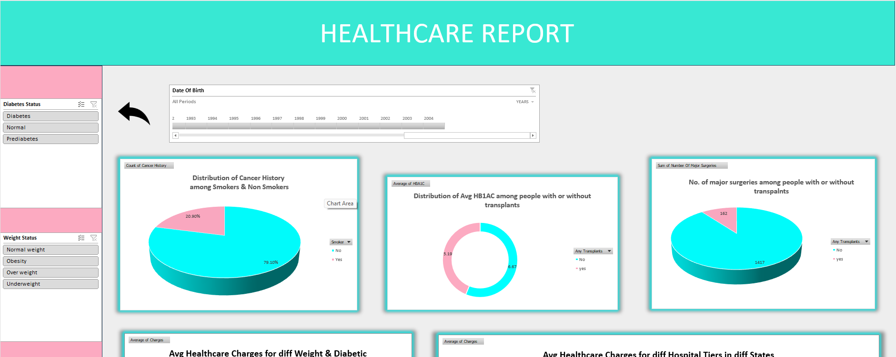
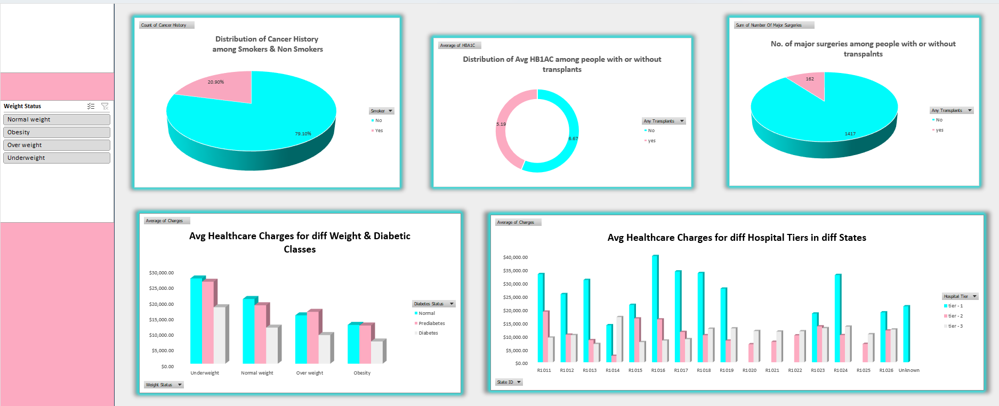
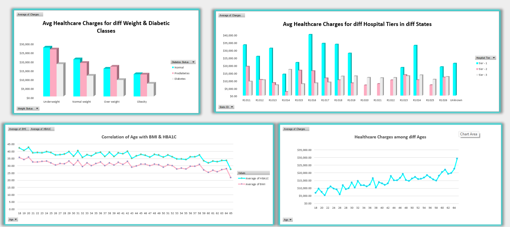

# Healthcare Data Analysis - Excel

## Project Overview

This project analyzes healthcare-related data using Microsoft Excel to identify trends, monitor KPIs, and generate business insights through dashboards, pivot tables, and data visualization techniques.

The analysis focuses on healthcare reporting, patient-related trends, and analytical insights using Excel-based tools.

---

## Business Problem

Healthcare organizations require efficient reporting and data analysis solutions to monitor operational performance, analyze patient-related data, and support data-driven decision-making.

This project focuses on performing healthcare analytics using Excel for reporting, KPI tracking, and visualization.

---

## Tools & Technologies Used

- Microsoft Excel
- Pivot Tables
- Pivot Charts
- Data Cleaning
- Conditional Formatting
- Dashboarding
- KPI Reporting

---

## Key Features

- Healthcare KPI analysis
- Data cleaning and preprocessing
- Pivot table analysis
- Interactive dashboard creation
- Trend analysis
- Data visualization
- Reporting and insights
- Excel-based analytics

---

## Key Insights

- Analyzed healthcare-related metrics and trends
- Generated dashboard-based insights using Excel
- Performed KPI reporting and visualization
- Identified patterns through pivot table analysis
- Created analytical healthcare reports

---

## Conclusion

This project demonstrates practical Excel analytics and dashboarding skills through healthcare-focused reporting, KPI analysis, and business insight generation.

---

# Dashboard Preview

## Healthcare Dashboard Overview 1

## Healthcare Dashboard Overview 2

## Healthcare Dashboard Overview 3

