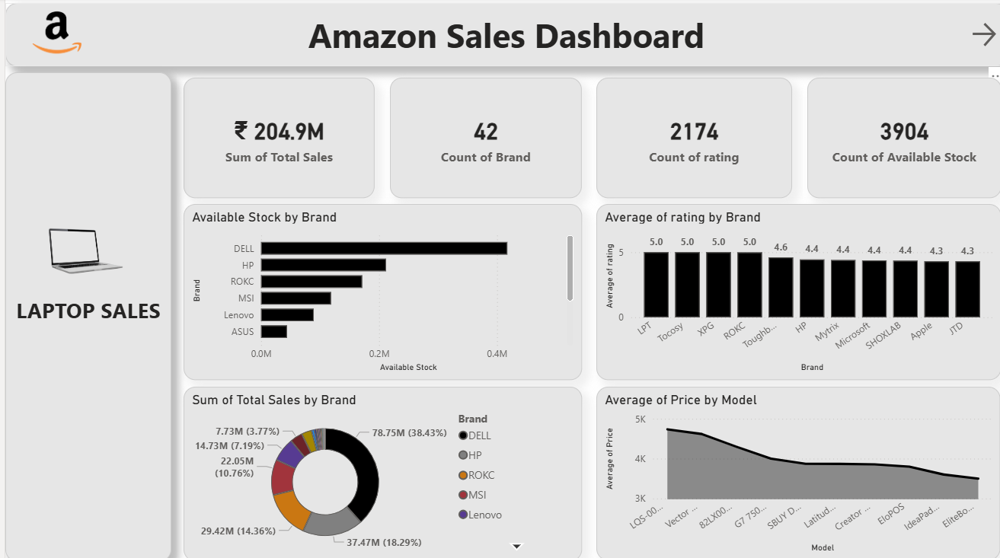
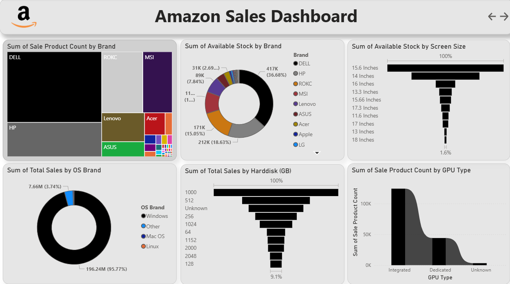
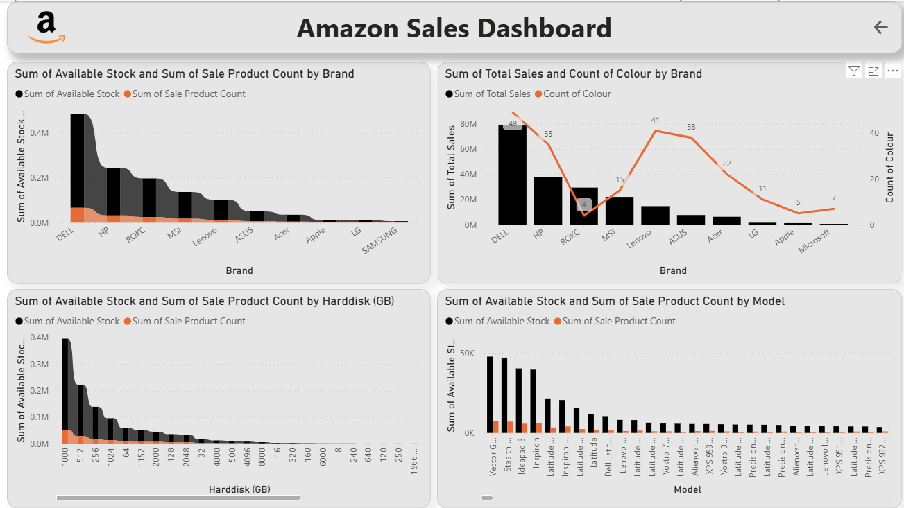

# Laptop Sales Analytics Dashboard - Power BI

## Project Overview

This project analyzes laptop sales data using Power BI to track sales performance, revenue metrics, product trends, and business insights through interactive dashboards.

---

## Tools & Technologies Used

- Power BI
- DAX
- Power Query
- Data Modeling
- Dashboarding

---

## Key Features

- Sales KPI analysis
- Revenue tracking
- Product performance insights
- Interactive visualizations
- Sales trend analysis
- Dynamic filters and slicers

---

## Conclusion

This project demonstrates practical business intelligence and sales analytics skills using Power BI, focusing on KPI reporting and interactive dashboard development.

---

# Dashboard Preview

## Amazon Laptop Sales Dashboard - Overview

## Sales Performance & Insights

## Revenue & Product Analysis

