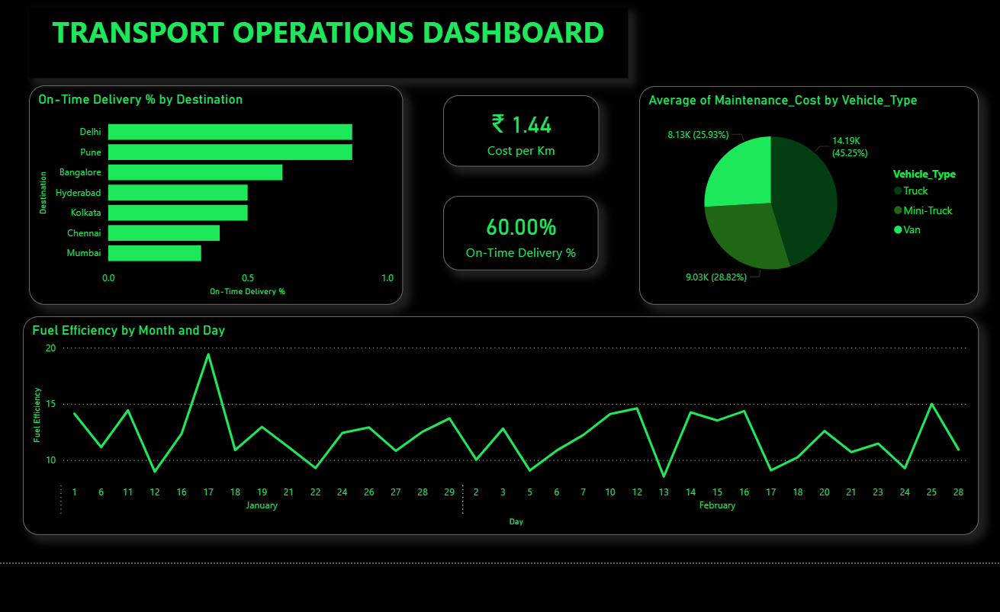

# Logistics & Fleet Analytics Dashboard - Power BI

## Project Overview

This project focuses on analyzing logistics and transportation data using Power BI to monitor trip performance, vehicle operations, delivery efficiency, and operational KPIs through interactive dashboards and business intelligence reporting.

The dashboard provides actionable insights into fleet operations, on-time delivery performance, trip analytics, and transportation efficiency.

---

## Business Problem

Logistics and transportation companies require real-time visibility into delivery performance, vehicle utilization, and operational efficiency to improve supply chain performance and business decision-making.

This project aims to analyze transportation and fleet data to identify operational trends, monitor KPIs, and support data-driven logistics management.

---

## Tools & Technologies Used

- Power BI
- DAX
- Power Query
- Data Modeling
- Business Intelligence
- Dashboard Development
- KPI Reporting
- Data Visualization

---

## Key Features

- Trip performance analysis
- On-time delivery tracking
- Vehicle utilization insights
- Destination-wise delivery analysis
- KPI dashboard reporting
- Interactive filters and slicers
- Transportation trend visualization
- Operational performance monitoring

---

## Conclusion

This project demonstrates practical business intelligence and transportation analytics skills using Power BI, focusing on logistics monitoring, operational KPI analysis, and interactive dashboard development.

---

# Dashboard Preview

## Logistics & Fleet Dashboard - Overview

## Fleet Operations & KPI Analysis

