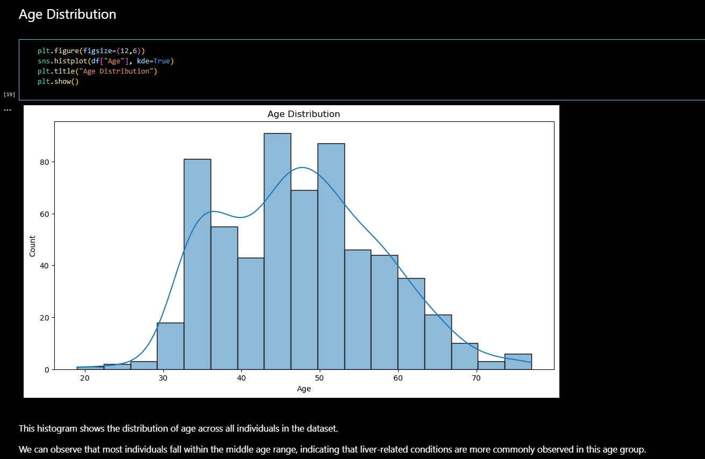
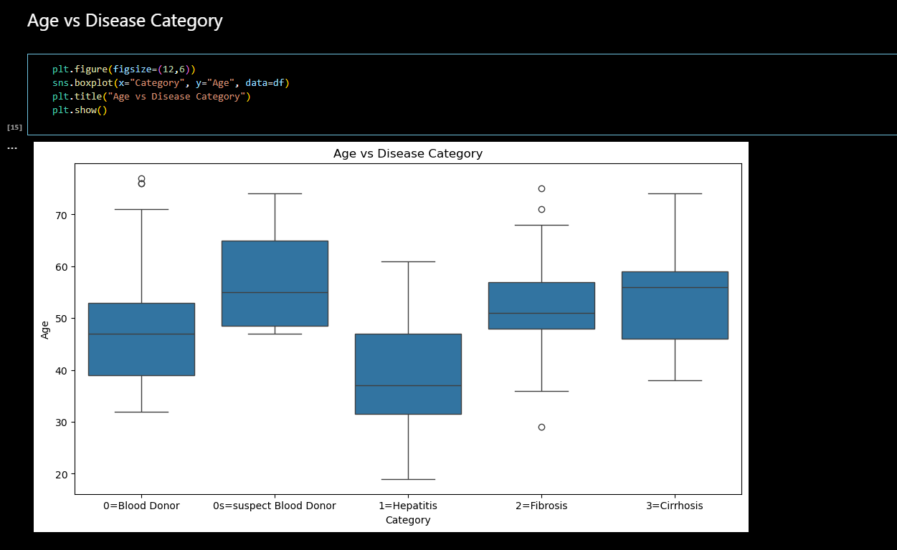
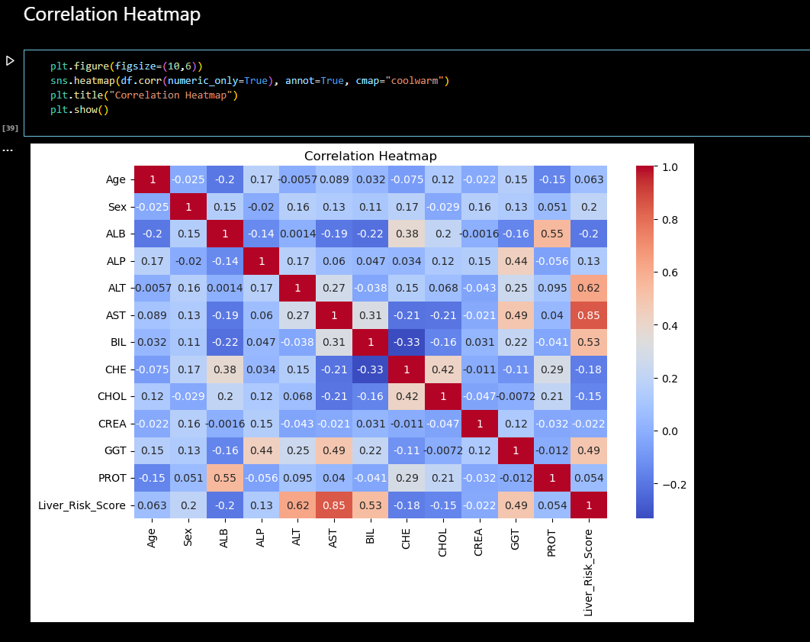
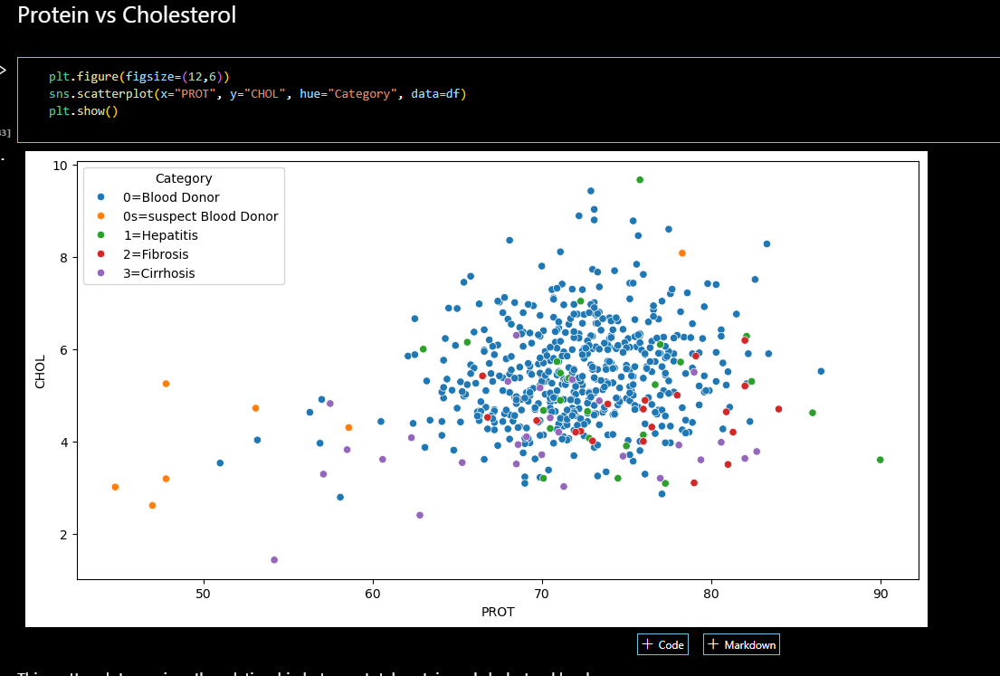
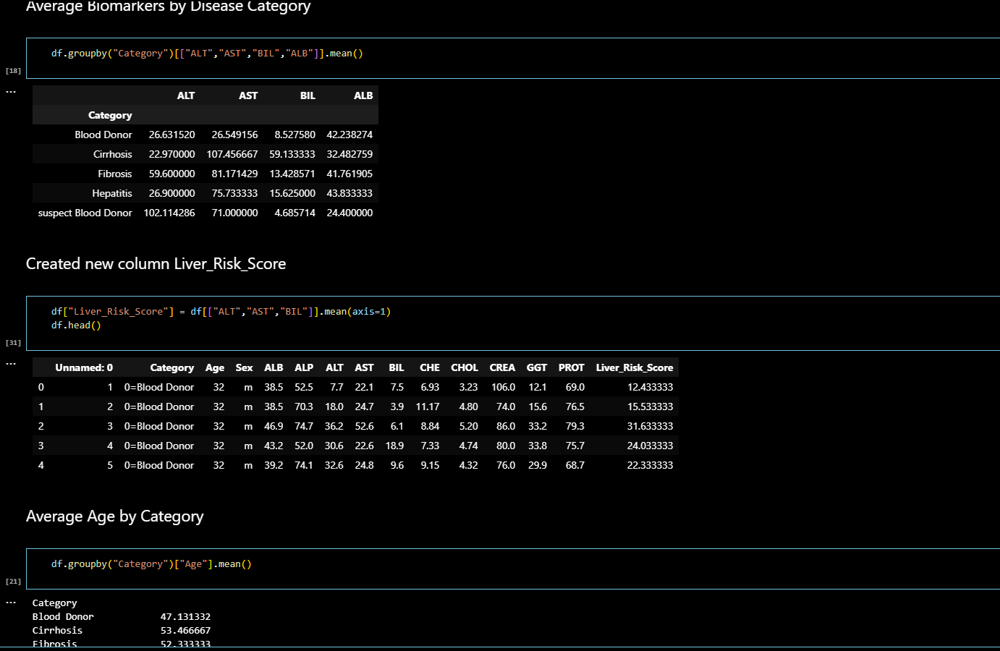
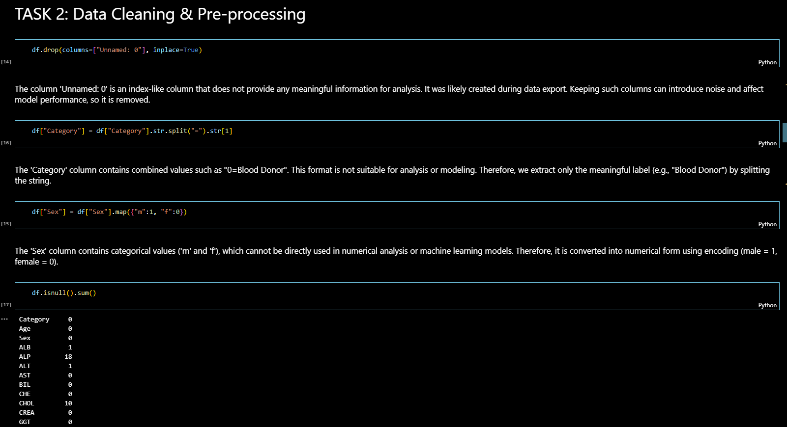

# Hepatitis C Data Analysis - Python

## Project Overview

This project analyzes Hepatitis C patient data using Python to identify health-related patterns, perform exploratory data analysis, and generate insights through statistical analysis and visualization techniques.

The analysis focuses on understanding medical indicators and data-driven healthcare insights.

---

## Business Problem

Healthcare analytics plays a critical role in identifying disease patterns, improving patient monitoring, and supporting data-driven medical research.

This project focuses on analyzing Hepatitis C data to uncover trends, evaluate medical attributes, and perform analytical exploration using Python.

---

## Tools & Technologies Used

- Python
- Pandas
- NumPy
- Matplotlib
- Seaborn
- Jupyter Notebook

---

## Key Features

- Data cleaning and preprocessing
- Exploratory Data Analysis (EDA)
- Medical data visualization
- Correlation analysis
- Statistical trend analysis
- Data-driven healthcare insights
- Feature analysis
- Visualization and reporting

---

## Key Insights

- Analyzed patient-related medical indicators
- Identified patterns and correlations in healthcare data
- Performed exploratory statistical analysis
- Generated healthcare insights through visualization
- Evaluated trends in Hepatitis C dataset attributes

---

## Conclusion

This project demonstrates practical Python data analytics and visualization skills through healthcare-focused exploratory data analysis and statistical insight generation.

---

# Analysis Preview

## Preview 1

## Preview 2

## Preview 3

## Preview 4

## Preview 5

## Preview 6

