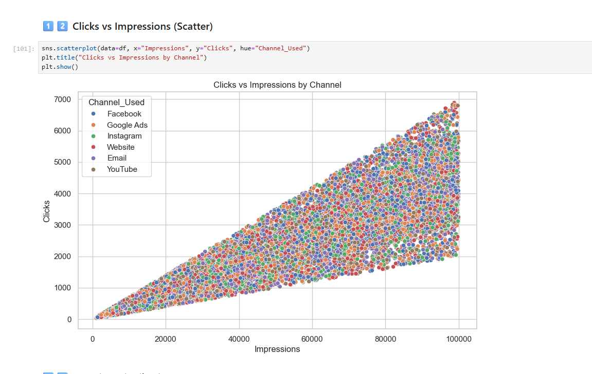
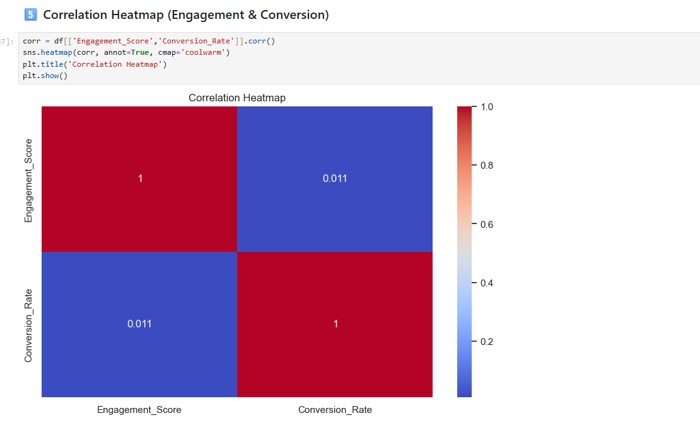
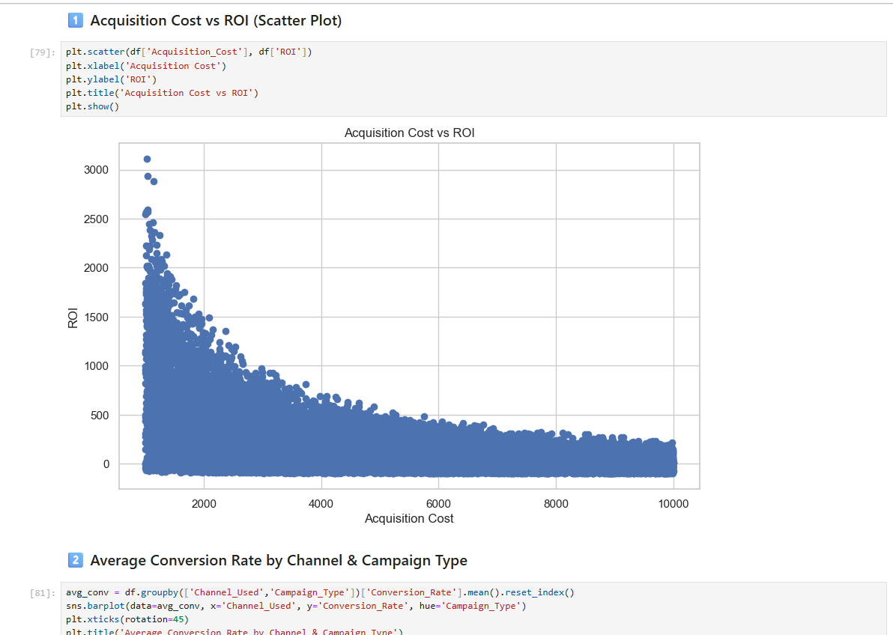
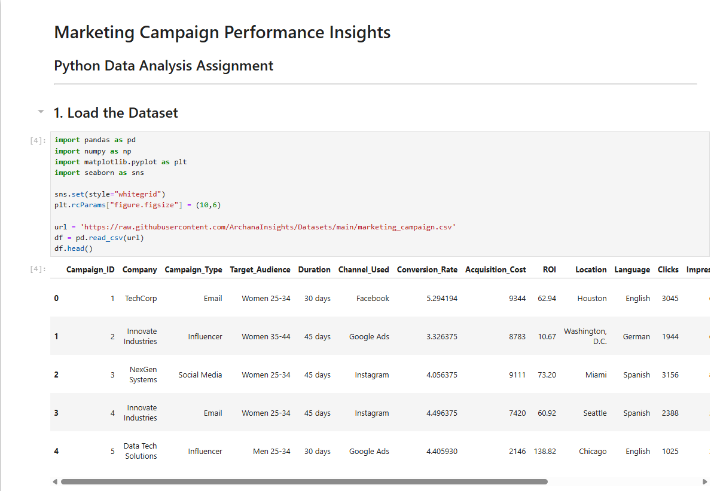
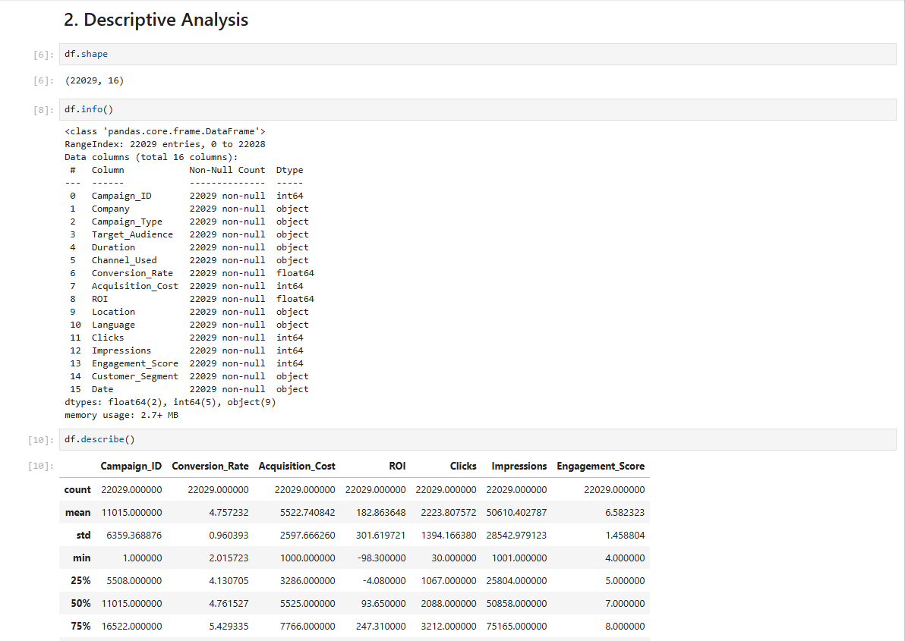
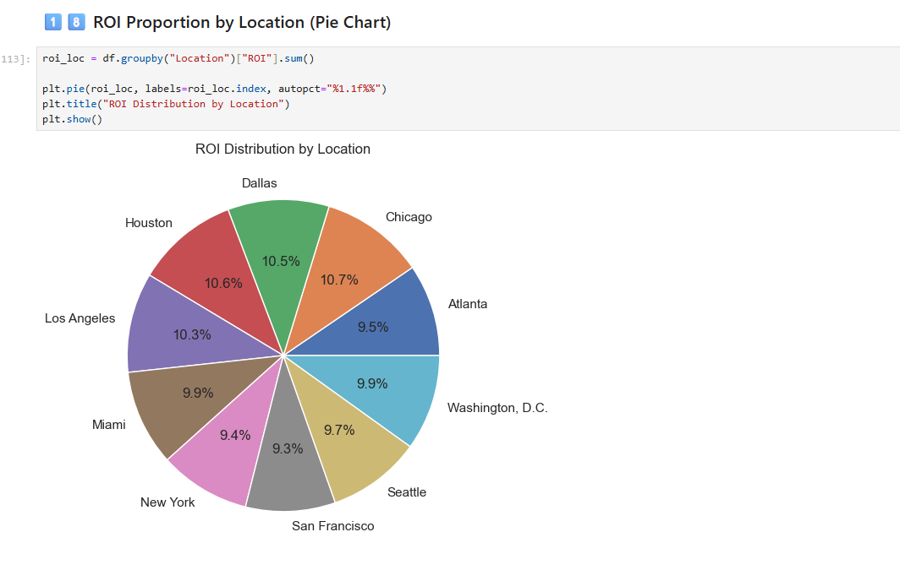

# Marketing Campaign Performance Analysis - Python

## Project Overview

This project analyzes marketing campaign performance data using Python to evaluate campaign effectiveness, customer engagement, conversion trends, and business insights through exploratory data analysis and visualization techniques.

The analysis helps identify high-performing campaigns and supports data-driven marketing decision-making.

---

## Business Problem

Marketing teams require data-driven insights to understand customer engagement, optimize campaign performance, and improve conversion rates.

This project focuses on analyzing campaign performance metrics to uncover trends, evaluate KPIs, and support strategic marketing optimization.

---

## Tools & Technologies Used

- Python
- Pandas
- NumPy
- Matplotlib
- Seaborn
- Jupyter Notebook

---

## Key Features

- Data cleaning and preprocessing
- Exploratory Data Analysis (EDA)
- Customer engagement analysis
- Campaign performance evaluation
- KPI analysis
- Data visualization
- Trend analysis
- Insight generation

---

## Key Insights

- Identified high-performing marketing campaigns
- Analyzed customer engagement trends
- Evaluated conversion-related metrics
- Generated actionable business insights through visualization
- Performed data-driven campaign analysis

---

## Conclusion

This project demonstrates practical data analytics and exploratory data analysis skills using Python, focusing on marketing analytics, visualization, and business insight generation. 

---

# Analysis Preview

## Preview 1

## Preview 2

## Preview 3

## Preview 4

## Preview 5

## Preview 6

